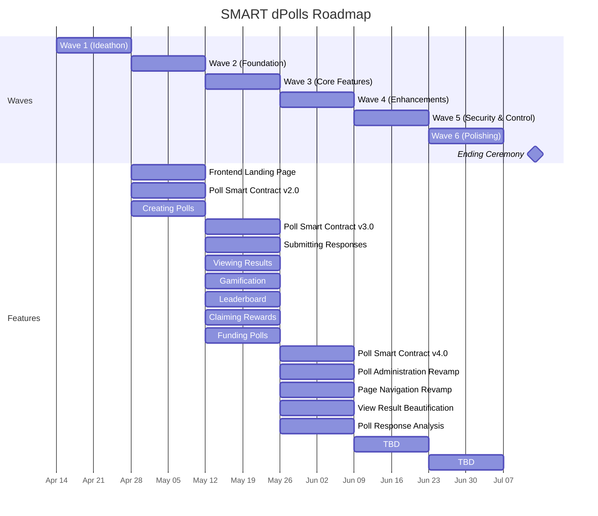

# 🚨 **BETA RELEASE** 🚨

> **This is a beta version. Expect frequent updates and potential changes.**  

# NERO Decentralized Polls

[](#)
[](LICENSE)  

NERO decentralized polls - where your opinion matters.  
Follow the steps below for a quick and easy setup.


* [Roadmap](#roadmap)
* [Demo](#demo)

## Roadmap



## Demo

Try out our demo site at:  
[https://dpolls.vercel.app/](https://dpolls.vercel.app/)

## 📋 Prerequisites

- **Node.js**: `v22.4.1`
- **Yarn**: `v3.8.3`

## 🚀 Setup Instructions

### 1. Install Dependencies

Run the following command in your terminal:

```bash
yarn install
```

If install fails, try to delete yarn.lock, the run `yarn install`.

### 2. Start the Server

After installing the dependencies, start the development server with:

```bash
yarn dev
```

### 3. Deployment (vercel)

```bash
yarn build:demo
vercel build --prod
vercel --prebuilt --prod
```

`yarn build:demo && vercel build --prod && vercel --prebuilt --prod`


### 3. Deployment (Beta)

```bash

vercel project
vercel link --yes --project dpolls-beta
yarn build:demo
vercel build --prod
vercel --prebuilt --prod
```

## 📄 License

This project is distributed under the [MIT License](LICENSE).
